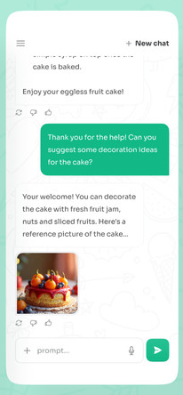

现在我需要一个安卓的app，可以和通义千问api进行对话，并且可以输入文字，然后点击发送按钮，可以发送文字，然后可以显示在界面上。
要求：
1.app开发语言使用kotlin
2.app开发框架使用jetpack compose
3.app开发工具使用android studio
4.app架构使用MVVM，且符合Android架构指南要求
5.app使用kotlin coroutine进行异步操作
6.app使用kotlin flow进行数据流操作
7.app使用kotlin koin进行依赖注入
8.app使用kotlin kotlinx.coroutines进行异步操作
9.app使用kotlin kotlinx.coroutines进行数据流操作
10.app使用kotlin kotlinx.coroutines进行依赖注入
11.AI智能回复调用通义千问Api
UI界面设计参考如下:
顶部区域
应用名称栏：位于屏幕最上方，背景为浅灰色，应用名称 “AI 助手” 居中显示，字体为简洁的无衬线字体，颜色为深灰色，字号适中，清晰易读。在应用名称左侧有一个三条横线的图标，代表菜单按钮，点击可弹出侧边栏菜单，包含设置、帮助、关于等选项。右侧有一个 “+” 号图标，点击可创建新的聊天会话，旁边有 “New chat” 字样，字体较小，颜色为浅灰色。
中间内容显示区域
聊天消息区域：占据屏幕中间大部分空间，背景为白色，消息气泡采用圆角矩形设计。
用户消息：用户发送的消息气泡为绿色，位于屏幕左侧，消息内容字体为白色，字号适中，气泡内文字左对齐，气泡边缘有一定的阴影效果，使其具有立体感，与背景区分明显。
AI 助手消息：AI 助手回复的消息气泡为白色，位于屏幕右侧，消息内容 字体为深灰色，字号与用户消息相同，气泡内文字左对齐。在 AI 助手消息气泡下方嵌入一张蛋糕的图片，图片大小适中，四周有轻微的圆角效果，与整体界面风格统一，图片下方有一行小字 “Reference picture”，字体颜色为浅灰色，字号较小。
底部区域
消息输入框：位于屏幕底部，背景为浅灰色，输入框为白色圆角矩形，占据底部区域的大部分宽度。输入框内有提示文字 “prompt...”，字体颜色为浅灰色，字号较小，提示用户在此输入消息。输入框右侧有一个绿色的发送按钮，按钮上有一个白色的箭头图标，箭头指向右侧，表示发送消息的方向，按钮大小适中，方便用户点击。在发送按钮左侧还有一个麦克风图标，用户可以通过语音输入消息，图标颜色为浅灰色，与整体界面色调协调。
整体风格
整体界面风格简洁、清新，采用浅色系为主色调，给人一种舒适、友好的感觉，符合聊天应用的轻松氛围。界面元素布局合理，操作方便，用户可以轻松地与 AI 助手进行交互和沟通。
交互设计
当用户点击顶部的菜单按钮时，侧边栏从屏幕左侧滑出，显示相关设置和帮助选项，用户可以进行个性化设置或获取帮助信息。
用户在消息输入框输入内容时，提示文字自动消失，输入完成后点击发送按钮，消息立即发送并显示在聊天区域，新消息的气泡会有淡入的动画效果，增强交互体验。

